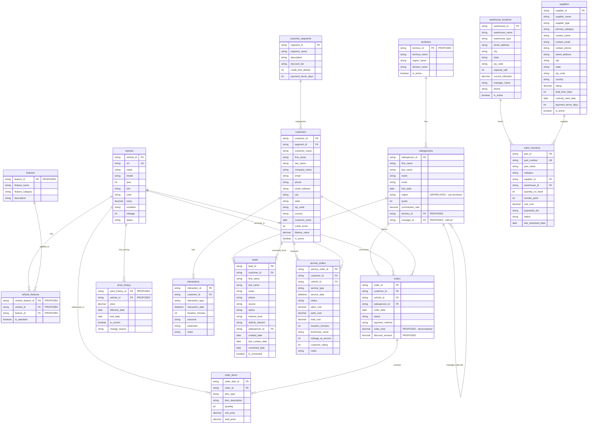

# Velocity Motors - Entity Relationship Diagram

This document provides a comprehensive ERD showing all tables in the Velocity Motors dataset, including proposed new tables and columns for advanced relationship patterns.

## Entity Relationship Diagram

## Table Summary

### Existing Tables (12)

| Domain | Table | Description | Approx Records |
|--------|-------|-------------|----------------|
| Sales | `salespersons` | Sales team members with quotas | ~50 |
| Sales | `vehicles` | Vehicle inventory | ~5,000 |
| Sales | `orders` | Customer vehicle orders | ~100,000 |
| Sales | `order_items` | Line items per order | ~150,000 |
| CRM | `customer_segments` | Segment definitions | 3 |
| CRM | `customers` | Customer master data | ~50,000 |
| CRM | `interactions` | Customer interaction history | ~500,000 |
| CRM | `leads` | Sales leads | ~60,000 |
| Operations | `warehouse_locations` | Distribution centers | ~10 |
| Operations | `suppliers` | Parts suppliers | ~50 |
| Operations | `parts_inventory` | Parts stock levels | ~2,000 |
| Operations | `service_orders` | Service/maintenance orders | ~30,000 |

### Proposed New Tables (4)

| Domain | Table | Pattern | Description |
|--------|-------|---------|-------------|
| Sales | `territories` | **Hierarchy** | Geographic hierarchy: Division > Region > Territory |
| Sales | `features` | **Many-to-Many** | Vehicle features/options catalog |
| Sales | `vehicle_features` | **Many-to-Many** | Junction table linking vehicles to features |
| Sales | `price_history` | **SCD Type 2** | Historical vehicle pricing with effective dates |

### Proposed Column Additions

| Table | Column | Pattern | Description |
|-------|--------|---------|-------------|
| `salespersons` | `territory_id` | **Hierarchy** | FK to territories table |
| `salespersons` | `manager_id` | **Self-Referential** | FK to salespersons (self) |
| `orders` | `order_total` | **Denormalized Aggregate** | Pre-computed order total |
| `orders` | `discount_amount` | **Denormalized** | Applied discount amount |

## Pattern Descriptions

### 1. Hierarchy Pattern (Territories)

The `territories` table implements a geographic hierarchy with three levels:
- **Division**: Highest level (e.g., "East", "West", "Central")
- **Region**: Mid-level (e.g., "Northeast", "Southeast", "Midwest")
- **Territory**: Lowest level, individual sales territories

This enables:
- ROLLUP aggregations from territory to region to division
- Flexible geographic reporting at any level
- Deprecates the flat `salespersons.region` column

### 2. Many-to-Many Pattern (Vehicle Features)

The `features` and `vehicle_features` tables implement a classic M2M relationship:
- **features**: Master list of all available vehicle features/options
- **vehicle_features**: Junction table with `is_standard` flag

Use cases:
- Find vehicles with specific feature combinations (AND/OR logic)
- Analyze feature popularity across vehicle types
- Support complex feature filtering in queries

### 3. Self-Referential Pattern (Manager Hierarchy)

The `salespersons.manager_id` column creates an organizational hierarchy:
- Each salesperson can have one manager (who is also a salesperson)
- Enables recursive CTEs for org chart traversal
- Supports multi-level management reporting

### 4. SCD Type 2 Pattern (Price History)

The `price_history` table implements Slowly Changing Dimension Type 2:
- **effective_date**: When this price became active
- **end_date**: When this price was superseded (NULL = current)
- **is_current**: Boolean flag for current price (optimization)

Use cases:
- Point-in-time price lookups for historical analysis
- Price change timeline and trend analysis
- Revenue variance analysis using historical prices

### 5. Denormalized Aggregate Pattern (Order Totals)

The `orders.order_total` column stores a pre-computed sum:
- Calculated as `SUM(order_items.total_price)` at order completion
- Enables fast order-level reporting without joins
- Requires validation against source data to detect discrepancies

The `orders.discount_amount` column stores applied discounts:
- Explains difference between gross and net order totals
- Supports discount analysis and reporting

## Data Integrity Notes

### Source of Truth Definitions

| Concept | Authoritative Source | Deprecated/Secondary |
|---------|---------------------|---------------------|
| Region | `territories.region_name` | `salespersons.region` |
| Current Price | `price_history.is_current = true` | `vehicles.msrp` (list price only) |
| Order Total | `SUM(order_items.total_price)` | `orders.order_total` (cached) |

### Referential Integrity

All proposed foreign keys should be enforced:
- `salespersons.territory_id` -> `territories.territory_id`
- `salespersons.manager_id` -> `salespersons.salesperson_id` (nullable for top-level)
- `vehicle_features.vehicle_id` -> `vehicles.vehicle_id`
- `vehicle_features.feature_id` -> `features.feature_id`
- `price_history.vehicle_id` -> `vehicles.vehicle_id`
