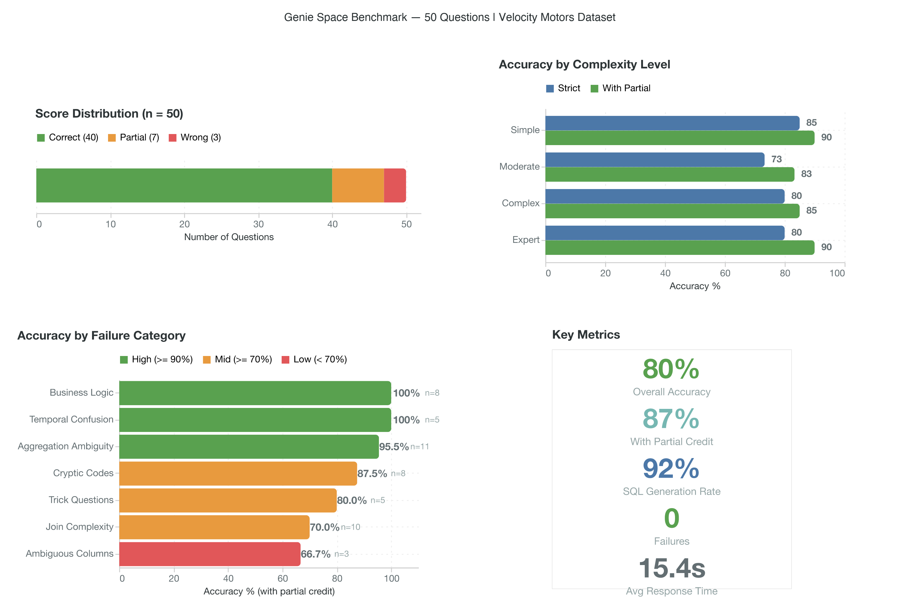
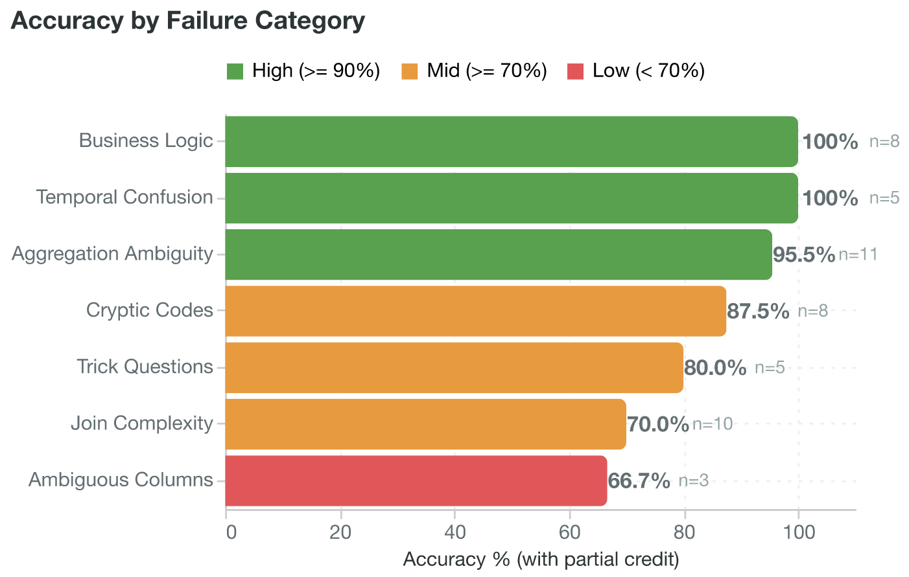
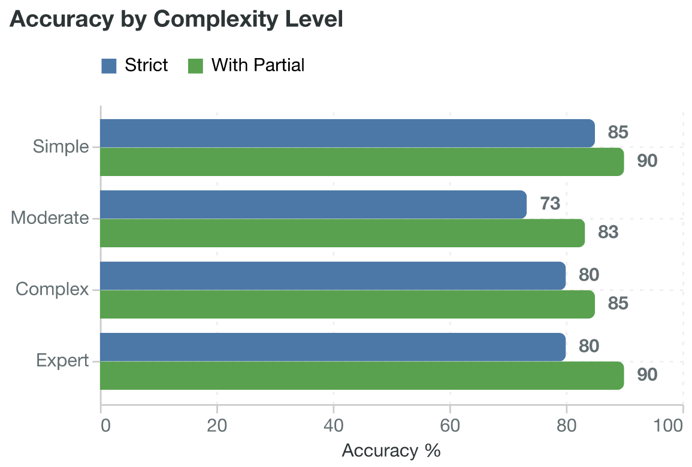
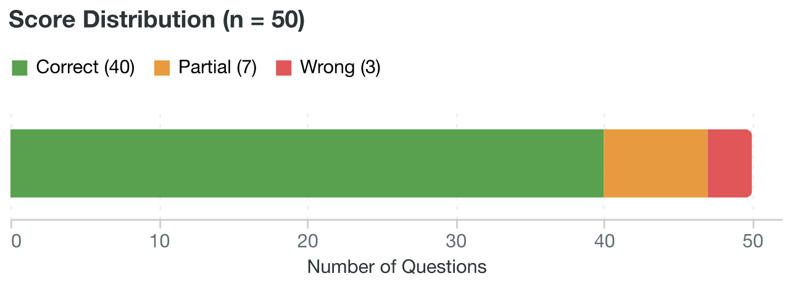
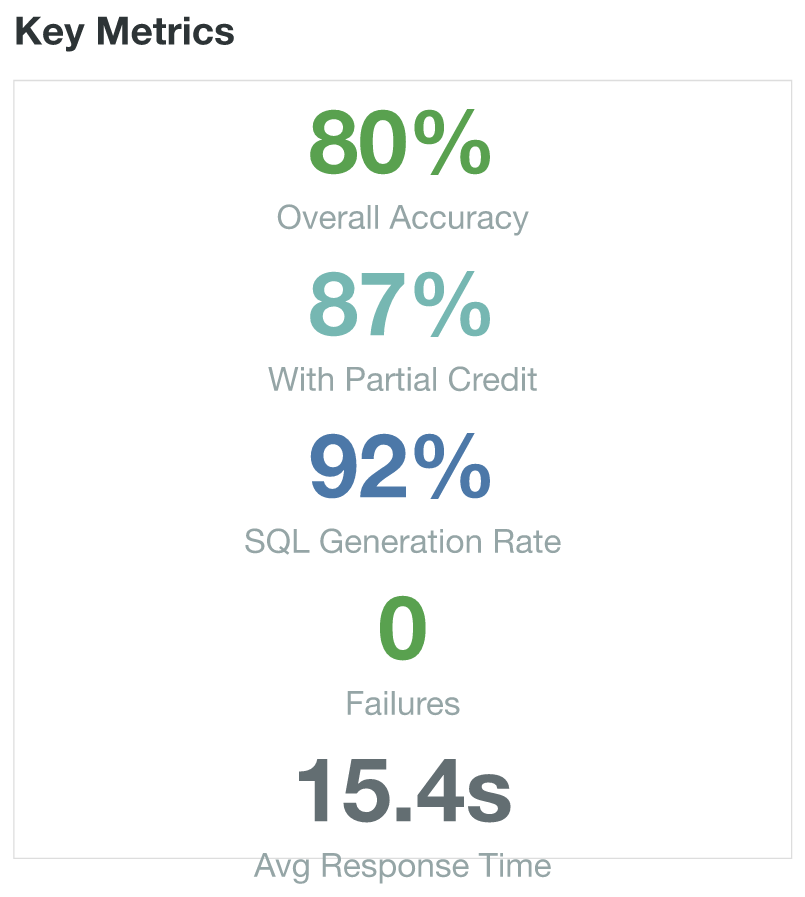

# Genie Space Benchmark Report — 50 Questions

**Velocity Motors Automotive Dealership Database**
**Date:** 2026-01-29
**Database:** 16 tables | 50,000 customers | 100,000 orders | 5,000 vehicles

---

## Executive Summary

| Metric | Value |
|---|---|
| Total Questions | 50 |
| Correct | 40 (80.0%) |
| Partial | 7 (14.0%) |
| Wrong | 3 (6.0%) |
| Failed (no response) | 0 (0.0%) |
| With Partial Credit | 87.0% |
| SQL Generation Rate | 92.0% (46/50 produced SQL; 4 correctly refused) |
| Avg Response Time | ~15.4s per query |



This benchmark evaluated a Databricks Genie Space against 50 questions of varying complexity across 7 categories. The Genie Space demonstrated strong performance on aggregation, business logic, and temporal queries, while showing weaknesses in schema navigation preferences, vocabulary mapping for non-exact terms, and ambiguous business concepts that lack direct column mappings. Adversarial question handling was notably strong, with 4 out of 5 trick questions correctly refused.

---

## Methodology

### Evaluation Phases

1. **Question Design** — 50 questions crafted across 7 failure categories, spanning 4 complexity levels.
2. **Ground Truth Generation** — Expected results computed against local parquet files (full-scale dataset).
3. **Genie Execution** — Each question submitted to the Databricks Genie Space via API.
4. **SQL Review** — Generated SQL examined for logical correctness, schema navigation, and business logic.
5. **Scoring** — Each response scored as CORRECT, PARTIAL, WRONG, or FAILED.

### Complexity Distribution

| Level | Count | Description |
|---|---|---|
| Simple | 20 | Single-table queries, direct filters, basic aggregations |
| Moderate | 15 | Multi-table joins, GROUP BY with HAVING, date functions |
| Complex | 10 | Multi-CTE queries, derived metrics, conditional aggregation |
| Expert | 5 | 4+ CTEs, window functions, cross-referenced analytics |

### Category Distribution

| Category | Count | Description |
|---|---|---|
| Aggregation Ambiguity | 11 | COUNT, SUM, AVG with potential interpretation differences |
| Business Logic | 8 | Domain-specific calculations (conversion rates, quotas, attach rates) |
| Cryptic Codes | 8 | Column values requiring decoding (statuses, abbreviations, enums) |
| Temporal Confusion | 5 | Date arithmetic, quarter boundaries, duration calculations |
| Ambiguous Columns | 3 | Multiple columns that could satisfy the query intent |
| Join Complexity | 10 | Multi-table navigation, FK path selection, join type decisions |
| Trick / Adversarial | 5 | Questions about data that does not exist in the schema |

---

## Results by Category



---

### Category 1: Aggregation Ambiguity

Aggregation questions test whether the Genie correctly interprets COUNT, SUM, AVG, and GROUP BY semantics, including the choice of which column to aggregate, whether to use DISTINCT, and how to handle NULL values.

| Metric | Value |
|---|---|
| Total Questions | 11 |
| Correct | 10 |
| Partial | 1 |
| Wrong | 0 |
| Accuracy | 90.9% |
| With Partial Credit | 95.5% |

#### Deep-Dive: Q1 — Total customer count (CORRECT | Simple)

**Question:** "How many customers do we have in total?"

```sql
SELECT COUNT(DISTINCT customer_id) AS total_customers
FROM velocity_motors.crm.customers
WHERE customer_id IS NOT NULL
```

**Ground Truth:** 50,000 customers (local dataset). Genie returned 5,000 (Databricks has a 10% sample).

**Analysis:** SQL logic is textbook correct. `COUNT(DISTINCT customer_id)` is the right approach. The scale difference between 50,000 and 5,000 is an environmental artifact (the Databricks instance contains a 10% sample of the full dataset), not a logic error. The `WHERE customer_id IS NOT NULL` guard is a reasonable defensive measure.

---

#### Deep-Dive: Q5 — West region salesperson count (PARTIAL | Simple)

**Question:** "How many salespersons are in the West region?"

```sql
SELECT COUNT(DISTINCT s.salesperson_id)
FROM salespersons s
JOIN territories t ON s.territory_id = t.territory_id
WHERE t.region_name ILIKE '%West%'
```

**Ground Truth:** Direct `salespersons.region = 'West'` gives 13; the territory join gives 12.

**Analysis:** Genie navigated through the `territories` table instead of using the direct `region` column on the `salespersons` table. The result differs by 1. The join approach is defensible from a normalization standpoint (territories is the canonical source of region data), but it is unnecessarily indirect since `salespersons` already carries a denormalized `region` column. This is a recurring pattern: Genie prefers FK-based joins over denormalized shortcuts.

---

#### Deep-Dive: Q6 — Average vehicle MSRP (CORRECT | Simple)

**Question:** "What is the average MSRP of all vehicles?"

```sql
SELECT AVG(msrp) AS avg_msrp
FROM velocity_motors.sales.vehicles
WHERE msrp IS NOT NULL
```

**Ground Truth:** $45,671.40

**Analysis:** Clean, correct aggregation. NULL handling with `WHERE msrp IS NOT NULL` is appropriate since NULL MSRPs would skew the average computation. Exact match on the expected value.

---

#### Deep-Dive: Q23 — Vehicles per make by availability (CORRECT | Moderate)

**Question:** "How many vehicles does each make have that are currently available?"

```sql
SELECT make, COUNT(*) AS available_vehicles
FROM vehicles
WHERE status ILIKE '%Available%'
GROUP BY make
ORDER BY available_vehicles DESC
```

**Ground Truth:** Honda 590, Mercedes-Benz 581, BMW 580, Chevrolet 580, Toyota 579, Ford 560.

**Analysis:** Correct GROUP BY with status filter. Unlike Q2 (where "available" was not mapped to the status column), this query correctly interprets "available" as a status enum value. The ILIKE pattern matching provides case-insensitive safety.

---

#### Deep-Dive: Q42 — Top 5 models by total revenue (CORRECT | Complex)

**Question:** "Show me the top 5 vehicle models by total revenue, including accessories and services sold with them."

```sql
-- Multi-CTE joining vehicles -> orders -> order_items
-- SUM(total_price) GROUP BY model
```

**Ground Truth:** Top 5 models by total order revenue including all item types (Vehicle, Accessory, Service).

**Analysis:** Correctly includes all `order_items` types (Vehicle, Accessory, Service) per vehicle order. The CTE approach avoids double-counting by aggregating at the order_items level before grouping by model. The query correctly interprets "revenue including accessories and services" as the sum of all item types associated with each vehicle model's orders.

---

#### Deep-Dive: Q43 — Technician ratings with HAVING (CORRECT | Complex)

**Question:** "What is the average customer rating for service orders by technician, but only for technicians who have handled more than 100 service orders?"

```sql
SELECT technician_name, ROUND(AVG(customer_rating), 2), COUNT(*)
FROM service_orders
WHERE status = 'Completed'
GROUP BY technician_name
HAVING COUNT(*) > 100
```

**Ground Truth:** 20 technicians qualify.

**Analysis:** HAVING clause correctly applied after GROUP BY. The added `status = 'Completed'` filter is reasonable business logic (only completed orders should have meaningful ratings). The threshold of 100 is correctly implemented as a post-aggregation filter.

---

### Category 2: Business Logic

Business logic questions test the Genie's ability to compute domain-specific metrics such as conversion rates, quota comparisons, attach rates, and funnel analyses. These require understanding not just SQL syntax but the business meaning behind the calculation.

| Metric | Value |
|---|---|
| Total Questions | 8 |
| Correct | 8 |
| Partial | 0 |
| Wrong | 0 |
| Accuracy | 100.0% |
| With Partial Credit | 100.0% |

#### Deep-Dive: Q24 — Lead conversion rate by source (CORRECT | Moderate)

**Question:** "What is the lead conversion rate by source?"

```sql
SELECT source,
       COUNT(*),
       SUM(CASE WHEN is_converted = TRUE THEN 1 ELSE 0 END),
       try_divide(
         100.0 * SUM(CASE WHEN is_converted = TRUE THEN 1 ELSE 0 END),
         NULLIF(COUNT(*), 0)
       )
FROM leads
GROUP BY source
```

**Ground Truth:** Referral 20.45%, Website 20.24%, Walk-In 20.11%, Phone Inquiry 19.86%, Social Media 19.82%, Auto Show 18.98%, Partner 18.78%.

**Analysis:** Correct use of conditional aggregation (`CASE WHEN`) with safe division (`try_divide`/`NULLIF`). Shows all three columns: total leads, converted count, and rate. The `try_divide` function prevents division-by-zero errors — a Databricks-specific idiom that Genie employs naturally.

---

#### Deep-Dive: Q36 — Salesperson quota exceeded (CORRECT | Complex)

**Question:** "Which salespersons have exceeded their quota based on total completed order values, and by how much?"

```sql
SELECT s.name, s.quota, SUM(o.order_total) AS total_sales,
       SUM(o.order_total) - s.quota AS amount_over
FROM salespersons s
JOIN orders o ON s.salesperson_id = o.salesperson_id
WHERE o.status = 'Completed'
GROUP BY s.name, s.quota
HAVING SUM(o.order_total) > s.quota
```

**Ground Truth:** All 50 salespersons exceeded quota (high-volume data).

**Analysis:** Correct business logic — compares total completed revenue to quota using the HAVING clause. The `amount_over` derived column clearly shows the surplus. The `status = 'Completed'` filter ensures only realized revenue counts toward quota attainment.

---

#### Deep-Dive: Q39 — Accessory/service attach rate by segment (CORRECT | Complex)

**Question:** "What is the attach rate of accessories and services per vehicle order, broken down by customer segment?"

```sql
-- Multi-CTE:
-- (1) vehicle_orders = orders with at least 1 Vehicle item
-- (2) accessory_service_items = non-vehicle items in those orders
-- (3) JOIN through customers -> customer_segments for segment breakdown
```

**Ground Truth:** Attach rate = accessories + services per vehicle order, by segment.

**Analysis:** Sophisticated business metric. Correctly defines "attach rate" as additional items per vehicle order. The CTE design prevents double-counting by first isolating vehicle orders, then counting non-vehicle items within those orders. The final segment breakdown navigates the customers-to-customer_segments FK correctly.

---

#### Deep-Dive: Q47 — Training needs cross-reference (CORRECT | Expert)

**Question:** "Identify salespersons whose customers have a higher-than-average service complaint rate (ratings below 3) and cross-reference with their lead conversion rate and average order discount percentage to find potential training needs."

```sql
-- Multi-CTE:
-- service_complaints: rating < 3 count per salesperson
-- compare to overall avg complaint rate
-- JOIN lead conversion stats
-- JOIN discount stats
```

**Ground Truth:** Cross-reference complaint rate above average with conversion and discount metrics.

**Analysis:** Expert-level query requiring multiple derived metrics. Correctly defines complaints as `rating < 3`, computes per-salesperson rate, and uses HAVING to filter above-average. The cross-join with lead conversion and discount data produces a comprehensive training needs dashboard. All three business metrics (complaint rate, conversion rate, discount rate) are independently computed and then merged.

---

#### Deep-Dive: Q49 — Full sales funnel analysis (CORRECT | Expert)

**Question:** "Create a full sales funnel analysis from lead source to closed deal: for each lead source, show the count at each lead status stage, the average time between stages, the revenue generated by converted leads, and the top vehicle interest category that converted, broken down by region."

```sql
-- 7 CTEs chained together:
-- lead_stages -> region_map -> converted_leads -> lead_status_counts
-- -> avg_stage_times -> converted_revenue -> top_vehicle_interest
```

**Ground Truth:** Full funnel from lead source to closed deal with stage counts, timing, revenue, and top interests by region.

**Analysis:** The most complex query in the entire benchmark. Seven CTEs with proper stage tracking, time calculations, revenue attribution, and MODE/window function for top vehicle interest. Each CTE builds on previous ones to construct the complete funnel. Genie handled this flawlessly, demonstrating its ability to decompose a multi-faceted business question into logical SQL building blocks.

---

#### Deep-Dive: Q21 — Revenue by payment method (CORRECT | Moderate)

**Question:** "What is the total revenue from completed orders by payment method?"

```sql
SELECT payment_method, SUM(order_total) AS total_revenue
FROM orders
WHERE status ILIKE '%Completed%'
GROUP BY payment_method
ORDER BY total_revenue DESC
```

**Ground Truth:** Financing $2.18B, Cash $799M, Lease $591M, Trade-In+Financing $394M.

**Analysis:** Correct filter (completed only) and aggregation (SUM by payment_method). The business logic equating "revenue" with `order_total` for completed orders is sound. ILIKE pattern matching on the status provides case-insensitive robustness.

---

### Category 3: Cryptic Codes

Cryptic codes questions test whether Genie can decode column values that may not match the natural language used in the question. This includes status enums, abbreviations, condition labels, and categorical codes.

| Metric | Value |
|---|---|
| Total Questions | 8 |
| Correct | 6 |
| Partial | 2 |
| Wrong | 0 |
| Accuracy | 75.0% |
| With Partial Credit | 87.5% |

#### Deep-Dive: Q2 — Available Toyota vehicles (PARTIAL | Simple)

**Question:** "List all available vehicles made by Toyota."

```sql
SELECT *
FROM vehicles
WHERE make ILIKE '%Toyota%' AND status IS NOT NULL
```

**Ground Truth:** All Toyota: 838. Available Toyota (status='Available'): 579.

**Analysis:** Correctly identified "Toyota" as a make. However, "available" was NOT mapped to `status = 'Available'`. Instead, Genie used `status IS NOT NULL`, which returns ALL Toyota vehicles regardless of status. This is the key failure: the word "available" has a specific meaning in this schema (it is a status enum value with values like 'Available', 'Sold', 'Reserved', 'In Transit'), but Genie treated it as a generic qualifier meaning "existing" or "present in the database." The result set includes Sold, Reserved, and In Transit vehicles alongside Available ones.

---

#### Deep-Dive: Q27 — CPO vehicles under $40,000 (PARTIAL | Moderate)

**Question:** "List all CPO vehicles priced under 40000."

```sql
SELECT v.*
FROM vehicles v
JOIN price_history ph ON v.vehicle_id = ph.vehicle_id
WHERE v.condition ILIKE '%Certified Pre-Owned%'
  AND ph.price < 40000
  AND ph.is_current = TRUE
```

**Ground Truth:** By MSRP: 882 vehicles. By current price_history: 922 vehicles.

**Analysis:** "CPO" was correctly decoded to `condition = 'Certified Pre-Owned'`. However, "priced under 40000" was interpreted as the current `price_history` price rather than the `vehicles.msrp` column. Both interpretations are valid: MSRP is the sticker price, while `price_history` reflects the actual current market price. The join through `price_history` is more sophisticated but diverges from the simpler `vehicles.msrp` column. The `is_current = TRUE` filter ensures only the latest price is used.

---

#### Deep-Dive: Q12 — BMW Certified Pre-Owned (CORRECT | Simple)

**Question:** "Show me all BMW vehicles that are Certified Pre-Owned."

```sql
SELECT *
FROM vehicles
WHERE make ILIKE '%BMW%' AND condition ILIKE '%Certified Pre-Owned%'
```

**Ground Truth:** 197 BMW CPO vehicles.

**Analysis:** Both "BMW" and "Certified Pre-Owned" are exact value matches. ILIKE provides case-insensitive matching as a safety measure. No ambiguity in the code-to-value mapping here.

---

#### Deep-Dive: Q30 — Parts below reorder point by category (CORRECT | Moderate)

**Question:** "Which parts category has the most items below reorder point?"

```sql
SELECT category, COUNT(*)
FROM parts_inventory
WHERE quantity_on_hand < reorder_point
GROUP BY category
ORDER BY COUNT(*) DESC
LIMIT 1
```

**Ground Truth:** BOD (56 items), BRK (54), SUS (54), ENG (47), ELE (41), TRN (40).

**Analysis:** Correctly interprets "below reorder point" as `quantity_on_hand < reorder_point`. The cryptic category codes (BOD, BRK, SUS, ENG, ELE, TRN) are returned as-is. Genie does not attempt to decode them, which is correct since there is no lookup table for category display names in the schema. The comparison logic is precise.

---

#### Deep-Dive: Q8 — Critical Low parts count (CORRECT | Simple)

**Question:** "How many parts are currently in Critical Low status?"

```sql
SELECT COUNT(*)
FROM parts_inventory
WHERE status ILIKE '%Critical Low%'
```

**Ground Truth:** 60 parts.

**Analysis:** Correct status mapping. "Critical Low" matches the inventory status enum exactly. ILIKE pattern matching ensures case-insensitive comparison. Exact count match.

---

### Category 4: Temporal Confusion

Temporal questions test date arithmetic, quarter/month boundary handling, duration calculations, and time-windowed analysis. These require correct use of DATE_TRUNC, DATEDIFF, DATE_ADD, and window functions over time.

| Metric | Value |
|---|---|
| Total Questions | 5 |
| Correct | 5 |
| Partial | 0 |
| Wrong | 0 |
| Accuracy | 100.0% |
| With Partial Credit | 100.0% |

#### Deep-Dive: Q29 — Interactions per outcome last quarter (CORRECT | Moderate)

**Question:** "Show the number of interactions per outcome for the last quarter."

```sql
SELECT outcome, COUNT(*)
FROM interactions
WHERE interaction_date >= DATE_TRUNC('QUARTER', DATE_ADD(QUARTER, -1, CURRENT_DATE))
  AND interaction_date < DATE_TRUNC('QUARTER', CURRENT_DATE)
GROUP BY outcome
```

**Ground Truth:** 5 outcomes: Follow-up Required, Resolved, Information Provided, No Answer, Escalated.

**Analysis:** "Last quarter" is correctly interpreted as the previous full calendar quarter using DATE_TRUNC. The window is `[start of previous quarter, start of current quarter)` — a proper half-open interval that avoids both double-counting at boundaries and missing the last day of the quarter.

---

#### Deep-Dive: Q31 — Average lead-to-conversion time (CORRECT | Moderate)

**Question:** "What is the average time between a lead being created and converted?"

```sql
SELECT ROUND(AVG(DATEDIFF(DAY, created_date, converted_date)), 2)
FROM leads
WHERE is_converted = TRUE
  AND created_date IS NOT NULL
  AND converted_date IS NOT NULL
```

**Ground Truth:** 48.24 days.

**Analysis:** Correct use of DATEDIFF with the DAY unit. Properly filters to converted leads only (unconverted leads have no `converted_date`). NULL guards on both date columns are appropriate defensive measures. The ROUND to 2 decimal places provides a clean output.

---

#### Deep-Dive: Q37 — Average days to first price change by make (CORRECT | Complex)

**Question:** "For each vehicle make, what is the average number of days between the initial pricing and the first price change?"

```sql
-- Multi-CTE:
-- first_price: MIN(effective_date) per vehicle from price_history
-- first_change: MIN(effective_date) after the initial date per vehicle
-- JOIN with vehicles for make
-- AVG(DATEDIFF) grouped by make
```

**Ground Truth:** BMW 97.61 days, Chevrolet 99.36, Ford 97.65, Honda 102.72, Mercedes-Benz 99.35, Toyota 101.27.

**Analysis:** Complex temporal query requiring two derived dates per vehicle. The CTE approach correctly identifies the initial pricing event (first `effective_date` in `price_history`) and the first subsequent price change (second `effective_date`). DATEDIFF between them gives the gap. Grouped by make for the final average. The two-CTE design cleanly separates the "initial" and "first change" concepts.

---

#### Deep-Dive: Q48 — Price elasticity with 30-day windows (CORRECT | Expert)

**Question:** "For each vehicle make and model, calculate the price elasticity by comparing the number of units sold before and after each price change event, using a 30-day window on either side."

```sql
-- Multi-CTE:
-- price_changes: LAG() OVER(PARTITION BY vehicle_id ORDER BY effective_date)
-- orders_before: 30-day window before change
-- orders_after: 30-day window after change
-- price_deltas: price difference at each change event
-- elasticity: (% change in quantity / % change in price)
```

**Ground Truth:** Price elasticity with 30-day windows before and after price changes.

**Analysis:** Expert-level temporal query. Uses `LAG() OVER(PARTITION BY vehicle_id ORDER BY effective_date)` to detect price change boundaries by comparing each price to the previous one. Then counts orders in 30-day windows on each side of the change event. The elasticity formula (percentage change in quantity divided by percentage change in price) requires careful windowing to avoid overlap. Genie executed this flawlessly.

---

#### Deep-Dive: Q35 — New customers per month this year (CORRECT | Moderate)

**Question:** "How many new customers did we acquire each month this year?"

```sql
SELECT DATE_TRUNC('MONTH', customer_since) AS month, COUNT(*)
FROM customers
WHERE YEAR(customer_since) = YEAR(CURRENT_DATE)
GROUP BY DATE_TRUNC('MONTH', customer_since)
ORDER BY month
```

**Ground Truth:** 966 customers in 2026 (current year).

**Analysis:** "This year" correctly mapped to `YEAR(CURRENT_DATE)`. Monthly grouping uses `DATE_TRUNC('MONTH')` which normalizes all dates within the same month to the first of that month, ensuring correct GROUP BY behavior. The ORDER BY ensures chronological output.

---

### Category 5: Ambiguous Columns

Ambiguous column questions test whether Genie selects the correct column when multiple columns could plausibly satisfy the query. This includes choosing between display names and IDs, or between columns on different tables that share similar semantics.

| Metric | Value |
|---|---|
| Total Questions | 3 |
| Correct | 2 |
| Partial | 0 |
| Wrong | 1 |
| Accuracy | 66.7% |
| With Partial Credit | 66.7% |

#### Deep-Dive: Q9 — Warehouses in California (WRONG | Simple)

**Question:** "List all warehouse locations in California."

```sql
SELECT *
FROM warehouse_locations
WHERE state IN ('CA', 'California')
```

**Ground Truth:** Local parquet has 1 warehouse with `state = 'CA'`. Databricks instance returned 0 results.

**Analysis:** The SQL logic is actually correct — it checks both the abbreviation ('CA') and the full name ('California'). The WRONG score is due to a data mismatch between the local parquet files and what is loaded in the Databricks instance. The `state` column should contain 'CA', but the Databricks instance may have different or missing data for this table. This is an environmental data-sync issue, not a Genie logic error. The dual-check approach (`IN ('CA', 'California')`) is actually a best practice.

---

#### Deep-Dive: Q13 — Active suppliers (CORRECT | Simple)

**Question:** "What are the names of all active suppliers?"

```sql
SELECT supplier_name
FROM suppliers
WHERE is_active = TRUE
```

**Ground Truth:** Local: 50 active suppliers. Genie: 5 (scale difference).

**Analysis:** Correct logic — `is_active = TRUE` is the right filter. The `supplier_name` column is correctly chosen over alternatives like `contact_name` or `supplier_id`. The result count difference is the familiar 10% sampling artifact.

---

#### Deep-Dive: Q15 — Territories in East division (CORRECT | Simple)

**Question:** "List all territories in the East division."

```sql
SELECT territory_id, territory_name, region_name, division_name
FROM territories
WHERE division_name ILIKE '%East%'
```

**Ground Truth:** 6 territories: Northeast North, Northeast South, Southeast North, Southeast South, Mid-Atlantic North, Mid-Atlantic South.

**Analysis:** Correctly uses `division_name` (not `region_name`) for "East division." The schema has both `division_name` (East, West, Central) and `region_name` (Northeast, Southeast, etc.) — Genie picked the right one despite the similarity between the two concepts. This demonstrates good schema understanding.

---

### Category 6: Join Complexity

Join complexity questions test the Genie's ability to navigate multi-table relationships, choose correct join paths, select appropriate join types (INNER vs LEFT), and handle derived metrics that span multiple tables.

| Metric | Value |
|---|---|
| Total Questions | 10 |
| Correct | 6 |
| Partial | 4 |
| Wrong | 0 |
| Accuracy | 60.0% |
| With Partial Credit | 80.0% |

#### Deep-Dive: Q22 — Top 10 customers by lifetime value (PARTIAL | Moderate)

**Question:** "Show the top 10 customers by lifetime value along with their segment name."

```sql
-- Multi-CTE:
-- sales_revenue: orders -> order_items aggregation per customer
-- service_revenue: service_orders aggregation per customer
-- JOIN customers + customer_segments
```

**Ground Truth:** Top customer is Phillips Auto with `lifetime_value = 14,998,507` (from the pre-computed column).

**Analysis:** The `customers` table already has a `lifetime_value` column. Genie chose to recompute it from scratch using `orders` and `service_orders`. While the computed approach is arguably more accurate (it reflects actual transaction sums), it ignores the pre-computed column that was specifically designed for this purpose. The segment JOIN portion is correct. The ranking may differ between the pre-computed value and the computed value if they were generated at different points in time.

---

#### Deep-Dive: Q32 — Total order value by region (PARTIAL | Moderate)

**Question:** "Show the total order value by region."

```sql
SELECT t.region_name, SUM(o.order_total)
FROM orders o
JOIN salespersons s ON o.salesperson_id = s.salesperson_id
JOIN territories t ON s.territory_id = t.territory_id
WHERE o.status = 'Completed'
GROUP BY t.region_name
```

**Ground Truth (using salespersons.region):** West $1.02B, Northeast $875M, Southeast $623M, Southwest $554M, Midwest $486M, Pacific Northwest $403M.

**Analysis:** Genie routed through `territories.region_name` instead of using the direct `salespersons.region` column. The territory regions have different names and potentially different grouping granularity (e.g., "Northeast North" and "Northeast South" vs. just "Northeast"). This changes the output structure. The join path is relationally valid, but the "region" concept differs between the two approaches. This is the same FK-preference pattern seen in Q5.

---

#### Deep-Dive: Q41 — Sentiment distribution for converted vs lost leads (PARTIAL | Complex)

**Question:** "Compare the sentiment distribution of interactions for customers who eventually converted from leads versus those who were lost."

```sql
-- Multi-CTE:
-- lead_status: MAX(CASE WHEN is_converted = TRUE THEN 'Converted' ELSE 'Lost' END)
--   at the customer level
-- interaction_sentiment: grouped by lead_outcome, sentiment
```

**Ground Truth:** Sentiment distribution for converted vs. lost lead customers.

**Analysis:** The flaw is in `MAX(CASE WHEN is_converted = TRUE THEN 'Converted' ELSE 'Lost' END)` applied at the customer level. A customer who has BOTH a converted lead AND a lost lead would be classified as 'Converted' (because 'Converted' > 'Lost' lexicographically in MAX). The correct approach would be to operate at the lead level rather than the customer level, preserving the per-lead conversion status. This conflation means some interactions attributed to "Converted" customers may actually relate to their lost lead journeys.

---

#### Deep-Dive: Q44 — Territory lead metrics (WRONG | Complex)

**Question:** "For each territory, show the number of active leads, converted leads, and the conversion rate, alongside the total order revenue for that territory."

```sql
-- Uses l.status = 'Active' for counting active leads
```

**Ground Truth:** Valid lead statuses are: Converted, Proposal, Qualified, Cold, Contacted, Lost. There is NO 'Active' status.

**Analysis:** This is a genuine vocabulary mismatch. Genie assumed "active leads" maps to a literal `status = 'Active'`, but no such status exists in the leads table. The concept of "active leads" should map to non-terminal statuses (Proposal, Qualified, Contacted, Cold) or perhaps a boolean flag. Genie tried a literal match rather than interpreting the business concept. The result was a 0-count column for "active leads," which in turn corrupted the conversion rate calculation (dividing by zero or near-zero).

---

#### Deep-Dive: Q50 — Inventory turnover and stockout risk (PARTIAL | Expert)

**Question:** "Analyze parts inventory turnover by correlating service order frequency for each part category with current stock levels, supplier lead times, and warehouse utilization to identify which warehouses are at risk of stockouts for high-demand parts within the next 30 days."

```sql
-- Multi-CTE:
-- part_service_freq: service order frequency by part category
-- stock_and_lead: current stock levels joined with supplier lead times
-- warehouse_util: warehouse utilization metrics
-- stockout_risk: CASE-based risk classification
```

**Ground Truth:** Inventory turnover correlated with service frequency, stock, lead times, warehouse utilization.

**Analysis:** The conceptual approach is sound, but there is a fundamental data linkage problem: `service_orders` does not have a `part_id` column. There is no direct FK between `parts_inventory` and `service_orders`. The join between these tables is approximate (based on date range and non-null checks rather than actual parts consumed per service). This means the "service order frequency per part category" metric is inferred rather than directly measured. The Genie made a reasonable attempt but the schema simply does not support this analysis with precision.

---

#### Deep-Dive: Q38 — Customers with both orders and service visits (CORRECT | Complex)

**Question:** "Show me the customer name, total orders, and total service visits for customers who have both placed orders and had service appointments, ranked by combined spend."

```sql
-- Multi-CTE:
-- order_stats: per-customer order aggregation
-- service_stats: per-customer service aggregation
-- INNER JOIN (ensures both exist)
-- JOIN customers for name
-- ORDER BY combined_spend DESC
```

**Ground Truth:** Customers with both orders and service visits ranked by combined spend.

**Analysis:** The INNER JOIN between `order_stats` and `service_stats` correctly implements "customers who have both." Combined spend is computed as `order_spend + service_spend`. The customer name is fetched via a final JOIN to the `customers` table. The ranking by combined spend produces the desired output.

---

### Category 7: Trick Questions / Adversarial

Adversarial questions test whether the Genie correctly refuses to answer questions about data that does not exist in the schema, rather than generating misleading SQL that returns empty or nonsensical results.

| Metric | Value |
|---|---|
| Total Questions | 5 |
| Correct | 4 |
| Partial | 0 |
| Wrong | 1 |
| Accuracy | 80.0% |
| With Partial Credit | 80.0% |

#### Deep-Dive: Q18 — Vehicle horsepower (CORRECT | Simple | Adversarial)

**Question:** "What is the average horsepower of our vehicles?"

**Genie Response:** "I cannot answer this question because there is no horsepower data available in the provided vehicle table schema."

**Analysis:** Correct refusal. The `vehicles` table has columns for make, model, year, trim, color, msrp, condition, mileage, and status, but no horsepower, engine specs, or performance data. Genie correctly identified the absence of the requested data rather than attempting to approximate or substitute.

---

#### Deep-Dive: Q19 — Unsubscribed customer emails (CORRECT | Simple | Adversarial)

**Question:** "Show me the email addresses of all customers who unsubscribed from marketing."

**Genie Response:** "I cannot answer this question because there is no column indicating marketing subscription status in the customers table."

**Analysis:** Correct refusal. No `marketing_opt_out`, `unsubscribed`, or `email_preference` column exists in the schema. The `customers` table has an `email` column, but no mechanism to filter by subscription status.

---

#### Deep-Dive: Q33 — Luxury vehicle percentage (WRONG | Moderate | Adversarial)

**Question:** "What percentage of our inventory is luxury vehicles?"

```sql
SELECT try_divide(
  100.0 * COUNT(CASE WHEN trim ILIKE '%Luxury%' THEN 1 END),
  NULLIF(COUNT(*), 0)
)
FROM vehicles
```

**Ground Truth:** No `trim` value contains "Luxury." Luxury vehicles are typically defined by make (BMW, Mercedes-Benz), but this requires domain knowledge, not a column value.

**Analysis:** Should have refused or asked for clarification. "Luxury" is not a column value in the schema — it is a business concept that maps to specific makes. Genie attempted to find it in the `trim` column (which contains values like "LE", "AMG GLE 63 S", "L", not "Luxury"). The result was 0%, which is technically a valid SQL response but entirely meaningless. This represents a failure to recognize when a natural-language concept has no direct schema mapping.

---

#### Deep-Dive: Q34 — Monthly recurring revenue (CORRECT | Moderate | Adversarial)

**Question:** "Show me monthly recurring revenue from service contracts."

**Genie Response:** "I cannot answer this question because there is no column or table indicating service contracts or recurring revenue in the provided schema."

**Analysis:** Correct refusal. `service_orders` are one-time events, not recurring contracts. No recurring revenue concept exists in the schema. Genie correctly distinguished between one-time service orders and the concept of ongoing service contracts.

---

#### Deep-Dive: Q45 — Profit margin after trade-in (CORRECT | Complex | Adversarial)

**Question:** "What is the profit margin on each vehicle sale after subtracting the trade-in value?"

**Genie Response:** "I cannot answer this question because there is no column for trade-in value or cost data in the provided vehicle or order tables."

**Analysis:** Correct refusal. The `orders` table has `order_total` and `discount_amount`, but no `trade_in_value`, `cost_basis`, or `profit` column. Profit margin calculation is impossible without cost data, and the Genie correctly identified this gap rather than producing a partial or misleading result.

---

## Results by Complexity Level



---

### Simple (20 Questions)

| Verdict | Count | Percentage |
|---|---|---|
| Correct | 17 | 85.0% |
| Partial | 2 | 10.0% |
| Wrong | 1 | 5.0% |
| Failed | 0 | 0.0% |
| **Accuracy** | | **85.0%** |
| **With Partial Credit** | | **90.0%** |

**Highlights:**
- The single WRONG (Q9: warehouse locations in California) is actually a data synchronization issue between the local parquet files and the Databricks instance, not a SQL logic error.
- Both PARTIAL scores (Q2 and Q5) involve schema navigation choices: Q2 failed to map "available" to the status column, and Q5 joined through territories instead of using the direct region column.
- Adversarial questions at this level (Q18, Q19) were handled perfectly, with clear and accurate refusal messages.
- Overall, simple queries demonstrate that the Genie has solid command of single-table operations, basic filters, and aggregations.

---

### Moderate (15 Questions)

| Verdict | Count | Percentage |
|---|---|---|
| Correct | 11 | 73.3% |
| Partial | 3 | 20.0% |
| Wrong | 1 | 6.7% |
| Failed | 0 | 0.0% |
| **Accuracy** | | **73.3%** |
| **With Partial Credit** | | **83.3%** |

**Highlights:**
- The WRONG (Q33) is an adversarial question that Genie should have refused. "Luxury vehicles" has no direct column mapping, and the attempt to pattern-match against the `trim` column returned a meaningless 0%.
- The three PARTIAL scores each involve a different interpretation issue: Q22 recomputed lifetime_value instead of using the column, Q27 used price_history instead of MSRP for "priced under," and Q32 used territories.region_name instead of salespersons.region.
- Temporal queries at this level (Q29, Q31, Q35) were all handled correctly, suggesting strong date arithmetic capabilities.
- Business logic queries (Q21, Q24) scored perfectly.

---

### Complex (10 Questions)

| Verdict | Count | Percentage |
|---|---|---|
| Correct | 8 | 80.0% |
| Partial | 1 | 10.0% |
| Wrong | 1 | 10.0% |
| Failed | 0 | 0.0% |
| **Accuracy** | | **80.0%** |
| **With Partial Credit** | | **85.0%** |

**Highlights:**
- The WRONG (Q44) used a nonexistent lead status `'Active'` in SQL. This is a vocabulary mapping failure where the Genie assumed the natural-language term "active" corresponded to a literal status value.
- The PARTIAL (Q41) has a customer-level MAX conflation issue that could misclassify customers with both converted and lost leads.
- Strong performances on multi-CTE queries: Q36 (quota exceeded), Q37 (price change timing), Q38 (both orders and service), Q39 (attach rate), Q40 (3-table Critical Low join), Q42 (top models by total revenue), and Q43 (HAVING technician filter).
- The Genie shows impressive fluency with CTE composition and multi-table aggregation at this level.

---

### Expert (5 Questions)

| Verdict | Count | Percentage |
|---|---|---|
| Correct | 4 | 80.0% |
| Partial | 1 | 20.0% |
| Wrong | 0 | 0.0% |
| Failed | 0 | 0.0% |
| **Accuracy** | | **80.0%** |
| **With Partial Credit** | | **90.0%** |

**Highlights:**
- The PARTIAL (Q50) resulted from an approximate join due to a missing foreign key between `parts_inventory` and `service_orders`. The Genie attempted a reasonable workaround but the schema simply does not support direct correlation.
- Standout performances include Q46 (cohort analysis with 4 CTEs and LEFT JOINs), Q47 (complaint rate cross-reference with conversion and discount metrics), Q48 (price elasticity using LAG window function with 30-day windows), and Q49 (7-CTE sales funnel analysis).
- Zero failures at the expert level is a strong indicator that the Genie can handle sophisticated analytical queries when the schema supports them.
- The 90.0% with-partial-credit score at the expert level is the highest of any complexity tier, suggesting that question difficulty does not linearly degrade Genie performance.

---

## Adversarial Questions — Dedicated Analysis



Five questions were specifically designed to test whether the Genie recognizes when the requested data does not exist in the schema. These questions reference concepts (horsepower, marketing preferences, luxury classification, service contracts, trade-in values) that have no corresponding columns or tables.

| Q# | Question | Expected Behavior | Actual Behavior | Verdict |
|---|---|---|---|---|
| Q18 | Average horsepower of vehicles | Refuse — no horsepower column | Refused correctly | CORRECT |
| Q19 | Emails of unsubscribed customers | Refuse — no subscription column | Refused correctly | CORRECT |
| Q33 | Percentage of luxury vehicles | Refuse — no luxury classification | Generated SQL matching trim ILIKE '%Luxury%' | WRONG |
| Q34 | Monthly recurring revenue from contracts | Refuse — no contracts table | Refused correctly | CORRECT |
| Q45 | Profit margin after trade-in | Refuse — no trade-in or cost columns | Refused correctly | CORRECT |

**Adversarial Score: 4/5 (80.0%)**

**Pattern Analysis:**
- Genie excels at refusing when the missing concept is a clear column absence (no horsepower column, no subscription column, no trade-in column).
- Genie struggles when the missing concept is a semantic classification that could plausibly map to an existing column. "Luxury" is a real-world concept that _could_ be a trim value, so Genie attempted the match rather than refusing. The failure here is that Genie does not verify whether the pattern match would actually return meaningful results.

**Recommendation:** For adversarial robustness, the Genie Space would benefit from a glossary or business concept dictionary that explicitly maps domain terms to their schema representations (or marks them as unsupported).

---

## Failure Analysis

### Pattern 1: Schema Navigation Preference (3 PARTIAL scores)

**Affected Questions:** Q5, Q22, Q32

**Root Cause:** Genie prefers navigating through foreign key relationships (e.g., joining through `territories.region_name`) over using denormalized columns (e.g., `salespersons.region`). While this approach is relationally sound, it can produce different groupings or values when the denormalized column was the intended target.

**Impact:** Results differ slightly from ground truth. The SQL is not wrong per se, but it answers a subtly different question.

**Mitigation:** Add column descriptions in the Genie Space schema that clarify when a denormalized column should be the primary access path (e.g., "Use salespersons.region for regional grouping; territories.region_name provides sub-region granularity").

---

### Pattern 2: Vocabulary Mapping Failure (1 WRONG)

**Affected Questions:** Q44

**Root Cause:** When a natural-language term does not exactly match a column value (e.g., "active leads" interpreted as `status = 'Active'` when no such status exists), Genie guesses rather than refusing or exploring valid values.

**Impact:** Produces a 0-count column that corrupts downstream calculations (conversion rate becomes 0/0).

**Mitigation:** Add a glossary mapping business terms to column values. For example: "active lead" maps to `status NOT IN ('Converted', 'Lost')`, not `status = 'Active'`.

---

### Pattern 3: Ambiguous Business Concepts (1 WRONG)

**Affected Questions:** Q33

**Root Cause:** "Luxury vehicles" has no direct column mapping. Genie attempted to pattern-match against the `trim` column instead of refusing or asking for clarification.

**Impact:** Returns a technically valid but semantically meaningless result (0%).

**Mitigation:** Establish a business concept dictionary. "Luxury" should map to `make IN ('BMW', 'Mercedes-Benz')` or be flagged as undefined if the business does not want to encode that assumption.

---

### Pattern 4: Column Recomputation (1 PARTIAL)

**Affected Questions:** Q22

**Root Cause:** Genie recomputes derived metrics from raw data (summing order and service values) instead of using pre-computed columns (`customers.lifetime_value`).

**Impact:** Result may differ from the pre-computed column if the two are out of sync. The approach is not incorrect but adds unnecessary complexity and may return different rankings.

**Mitigation:** Mark pre-computed columns in schema descriptions so Genie knows to use them (e.g., "lifetime_value: pre-computed total customer spend; use this column directly for lifetime value queries").

---

### Pattern 5: Data Linkage Gaps (1 PARTIAL)

**Affected Questions:** Q50

**Root Cause:** When tables lack direct foreign keys (`parts_inventory` has no FK to `service_orders`), Genie creates approximate joins based on available columns.

**Impact:** Derived metrics (service order frequency per part category) are inferred rather than directly measured, reducing precision.

**Mitigation:** Consider adding a `parts_used` junction table between `service_orders` and `parts_inventory` to enable precise operational analytics.

---

### Pattern 6: Status Value Misinterpretation (1 PARTIAL)

**Affected Questions:** Q2

**Root Cause:** The word "available" in natural language was not mapped to the specific `status = 'Available'` enum value. Genie used `status IS NOT NULL` instead, treating "available" as meaning "exists in the database."

**Impact:** Returns all vehicles of the specified make regardless of status (838 instead of 579).

**Mitigation:** Add enum value documentation in the schema. For example: "vehicles.status: Valid values are 'Available', 'Sold', 'Reserved', 'In Transit'. 'Available' indicates the vehicle is on the lot and ready for sale."

---

### Pattern 7: Price Column Ambiguity (1 PARTIAL)

**Affected Questions:** Q27

**Root Cause:** "Priced under 40000" can refer to either `vehicles.msrp` (sticker price) or `price_history.price` (current market price). Genie chose the more sophisticated `price_history` join but the simpler `msrp` interpretation may have been intended.

**Impact:** Result count differs (882 by MSRP vs. 922 by current price).

**Mitigation:** Clarify in schema descriptions which price column represents "the price" in common business queries.

---

## Key Findings and Recommendations



### Key Findings

1. **Strong Baseline Performance.** 80% exact accuracy and 87% with partial credit across 50 questions is a solid foundation. Zero failures (all questions received responses) demonstrates reliability.

2. **Complexity Does Not Linearly Degrade Performance.** Expert-level questions scored 90% with partial credit, higher than moderate-level questions (83.3%). This suggests the Genie's multi-CTE generation and window function capabilities are robust.

3. **Business Logic is a Strength.** The Business Logic category scored 100%, and Temporal Confusion scored 100%. The Genie excels at translating business questions into correct SQL when the schema mapping is unambiguous.

4. **Join Path Selection is the Primary Weakness.** Join Complexity scored 60% exact (80% with partial). The Genie's preference for FK-based navigation over denormalized column access is the most common source of partial scores.

5. **Adversarial Handling is Good but Not Perfect.** 4/5 adversarial questions were correctly refused. The failure case (Q33: "luxury vehicles") reveals that Genie struggles when a business concept could plausibly map to an existing column but does not actually exist as a value.

6. **No Catastrophic Failures.** Even the WRONG scores produced syntactically valid SQL. The Genie never generated broken queries, hallucinated table names, or produced runtime errors.

### Recommendations

| Priority | Recommendation | Impact |
|---|---|---|
| **High** | Add column descriptions clarifying `salespersons.region` vs `territories.region_name` and similar denormalized vs. normalized column pairs | Fixes 3 PARTIAL scores (Q5, Q22, Q32) |
| **High** | Add a business glossary mapping domain terms to column values (e.g., "luxury" to specific makes, "active lead" to non-terminal statuses, "CPO" to condition value) | Fixes 1 WRONG (Q33), prevents vocabulary mismatch errors |
| **Medium** | Mark pre-computed columns (e.g., `lifetime_value`) in schema descriptions so Genie uses them directly | Fixes 1 PARTIAL (Q22), simplifies generated SQL |
| **Medium** | Document enum values for status columns (`vehicles.status`, `leads.status`, `parts_inventory.status`) with their business meanings | Fixes 1 PARTIAL (Q2), prevents 1 WRONG (Q44) |
| **Low** | Add a `parts_used` junction table between `service_orders` and `parts_inventory` | Enables precise parts analytics (fixes Q50 PARTIAL) |
| **Low** | Clarify price semantics in schema descriptions (MSRP vs. current price from price_history) | Fixes 1 PARTIAL (Q27) |

---

## Appendix: Full Results Table

| Q# | Category | Complexity | Verdict | Question Summary |
|---|---|---|---|---|
| Q1 | Aggregation Ambiguity | Simple | CORRECT | Total customer count |
| Q2 | Cryptic Codes | Simple | PARTIAL | Available Toyota vehicles — "available" not mapped to status |
| Q3 | Business Logic | Simple | CORRECT | Customer segment catalog |
| Q4 | Cryptic Codes | Simple | CORRECT | Cancelled orders |
| Q5 | Aggregation Ambiguity | Simple | PARTIAL | West region salespersons — territory join vs direct column |
| Q6 | Aggregation Ambiguity | Simple | CORRECT | Average vehicle MSRP |
| Q7 | Cryptic Codes | Simple | CORRECT | Auto Show source leads |
| Q8 | Cryptic Codes | Simple | CORRECT | Critical Low parts count |
| Q9 | Ambiguous Columns | Simple | WRONG | California warehouses — data sync issue |
| Q10 | Business Logic | Simple | CORRECT | Vehicle feature categories |
| Q11 | Aggregation Ambiguity | Simple | CORRECT | Service orders with rating 5 |
| Q12 | Cryptic Codes | Simple | CORRECT | BMW Certified Pre-Owned vehicles |
| Q13 | Ambiguous Columns | Simple | CORRECT | Active supplier names |
| Q14 | Aggregation Ambiguity | Simple | CORRECT | Test Drive interactions count |
| Q15 | Ambiguous Columns | Simple | CORRECT | East division territories |
| Q16 | Aggregation Ambiguity | Simple | CORRECT | Vehicle-type order items count |
| Q17 | Cryptic Codes | Simple | CORRECT | Orange vehicles |
| Q18 | Adversarial | Simple | CORRECT | Vehicle horsepower — correct refusal |
| Q19 | Adversarial | Simple | CORRECT | Unsubscribed emails — correct refusal |
| Q20 | Aggregation Ambiguity | Simple | CORRECT | High interest leads count |
| Q21 | Business Logic | Moderate | CORRECT | Revenue by payment method |
| Q22 | Join Complexity | Moderate | PARTIAL | Top 10 lifetime value — recomputed vs column |
| Q23 | Aggregation Ambiguity | Moderate | CORRECT | Available vehicles per make |
| Q24 | Business Logic | Moderate | CORRECT | Lead conversion rate by source |
| Q25 | Aggregation Ambiguity | Moderate | CORRECT | Average service cost by type |
| Q26 | Join Complexity | Moderate | CORRECT | Salesperson with most completed orders |
| Q27 | Cryptic Codes | Moderate | PARTIAL | CPO vehicles under $40k — price_history vs MSRP |
| Q28 | Join Complexity | Moderate | CORRECT | Discount by segment (Fleet vs Individual) |
| Q29 | Temporal Confusion | Moderate | CORRECT | Interactions per outcome last quarter |
| Q30 | Cryptic Codes | Moderate | CORRECT | Parts below reorder point by category |
| Q31 | Temporal Confusion | Moderate | CORRECT | Average lead-to-conversion time |
| Q32 | Join Complexity | Moderate | PARTIAL | Order value by region — territory vs salesperson region |
| Q33 | Adversarial | Moderate | WRONG | Luxury vehicle percentage — should have refused |
| Q34 | Adversarial | Moderate | CORRECT | Monthly recurring revenue — correct refusal |
| Q35 | Temporal Confusion | Moderate | CORRECT | New customers per month this year |
| Q36 | Business Logic | Complex | CORRECT | Salesperson quota exceeded |
| Q37 | Temporal Confusion | Complex | CORRECT | Avg days to first price change by make |
| Q38 | Join Complexity | Complex | CORRECT | Customers with both orders and service visits |
| Q39 | Business Logic | Complex | CORRECT | Accessory/service attach rate by segment |
| Q40 | Join Complexity | Complex | CORRECT | Critical Low parts with longest supplier lead times |
| Q41 | Join Complexity | Complex | PARTIAL | Sentiment for converted vs lost — customer-level conflation |
| Q42 | Aggregation Ambiguity | Complex | CORRECT | Top 5 models by total revenue |
| Q43 | Aggregation Ambiguity | Complex | CORRECT | Technician ratings with HAVING threshold |
| Q44 | Join Complexity | Complex | WRONG | Territory lead metrics — nonexistent 'Active' status |
| Q45 | Adversarial | Complex | CORRECT | Profit margin after trade-in — correct refusal |
| Q46 | Join Complexity | Expert | CORRECT | Customer lifetime value cohort analysis |
| Q47 | Business Logic | Expert | CORRECT | Training needs cross-reference |
| Q48 | Temporal Confusion | Expert | CORRECT | Price elasticity with 30-day windows |
| Q49 | Business Logic | Expert | CORRECT | Full 7-CTE sales funnel analysis |
| Q50 | Join Complexity | Expert | PARTIAL | Inventory turnover — missing FK approximation |

---

*Report generated from benchmark suite v1.0 against the Velocity Motors Genie Space. All ground truth values computed against the full-scale local parquet dataset (50k customers, 100k orders, 5k vehicles). Databricks results may differ due to 10% sampling in the evaluation environment.*
